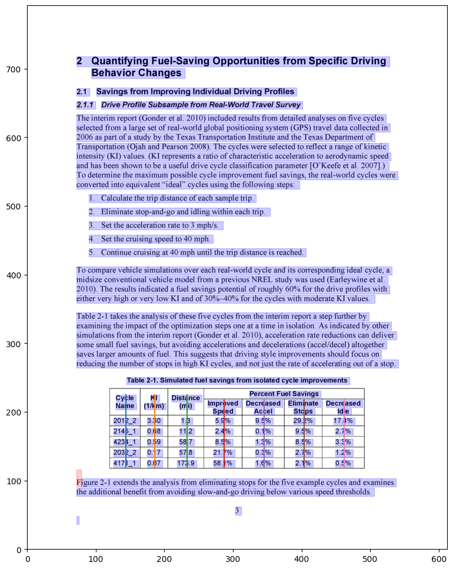
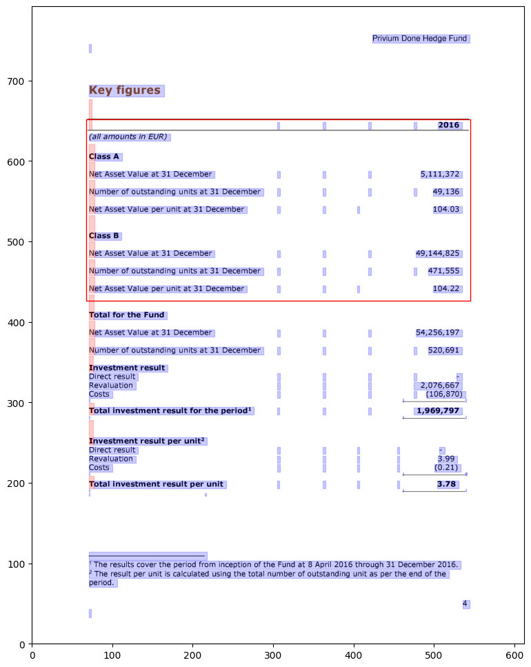
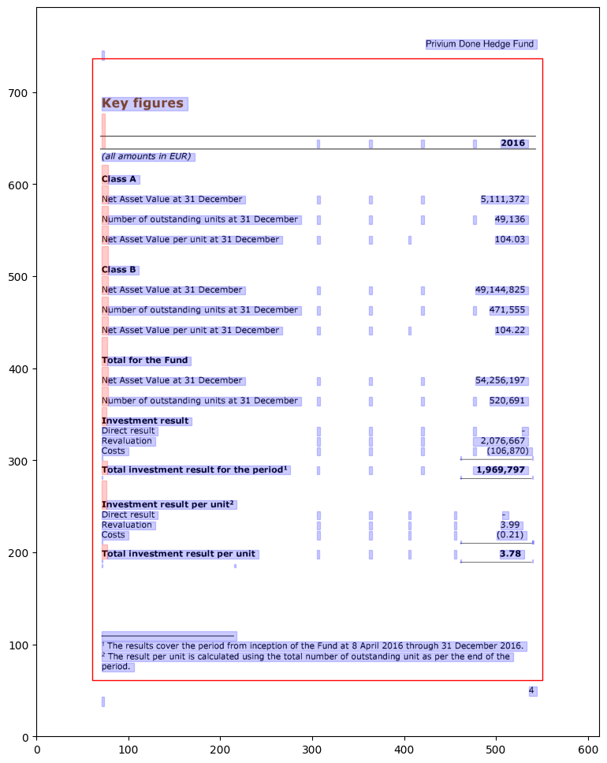

.. _advanced:

Advanced Usage
==============

This page covers some of the more advanced configurations for :ref:`Lattice <lattice>` and :ref:`Stream <stream>`.

Process background lines
------------------------

To detect line segments, :ref:`Lattice <lattice>` needs the lines that make the table to be in the foreground. Here's an example of a table with lines in the background:

.. figure:: ../_static/png/background_lines.png
    :scale: 50%
    :alt: A table with lines in background
    :align: center

Source: `PDF <../_static/pdf/background_lines.pdf>`__

To process background lines, you can pass ``process_background=True``.

.. code-block:: pycon

    >>> tables = camelot.read_pdf('background_lines.pdf', process_background=True)
    >>> tables[1].df

.. tip::
    Here's how you can do the same with the :ref:`command-line interface <cli>`.

    .. code-block:: console

        $ camelot lattice -back background_lines.pdf

.. csv-table::
  :file: ../_static/csv/background_lines.csv
  :class: full-width

Bridge gaps in ruled lines
--------------------------

When a Lattice-flavoured PDF's table is drawn with ruled lines that don't quite meet at corners (a common artefact of older scanned-then-redrawn forms), the detected grid drops the affected rows or columns. The ``iterations`` keyword argument dilates the line mask to close those gaps — but dilation alone also *thickens* every line, which in turn pushes the outer ruled lines outward and adds spurious extra rows above and below the real table.

Pair it with the new ``erode_iterations`` keyword to perform a **morphological closing** (dilate then erode of equal count): gaps are bridged without changing the line mask's overall size, so the detected grid stays right.

.. code-block:: pycon

    >>> # Bridges line gaps without thickening
    >>> tables = camelot.read_pdf(
    ...     'broken_lines.pdf',
    ...     flavor='lattice',
    ...     iterations=1,
    ...     erode_iterations=1,
    ... )

``erode_iterations`` defaults to ``0`` (fully backward-compatible with the long-standing dilate-only behaviour). Bump it together with ``iterations`` only when you've confirmed the legacy behaviour leaves phantom rows around your table.

.. _line_detection_engine:

Line-detection engine: raster, combined, auto
---------------------------------------------

By default :ref:`Lattice <lattice>` finds a table's ruled lines by **rasterising** the page (rendering it to an image) and detecting lines with OpenCV. That works well for scanned or image-based tables, but a PDF that draws its rules as *native vector graphics* carries the exact line coordinates already — and those rules sometimes render faintly or anti-aliased, so the rasteriser misses them.

The ``engine`` keyword lets you choose how lines are detected:

- ``'raster'`` *(default)* — OpenCV on the rendered page. The long-standing behaviour.
- ``'combined'`` — run raster detection **and** union in the ruled lines read straight from the PDF's vector graphics before the grid is reconstructed. A table whose rules are vector strokes is then found even when it renders faintly.
- ``'auto'`` — use ``'combined'`` when the page actually carries vector ruled lines, otherwise fall back to ``'raster'``.
- ``'vector'`` — *(reserved)* read lines only from the vector graphics, skipping rasterisation entirely. Not yet wired; raises ``NotImplementedError`` for now.

.. code-block:: pycon

    >>> # Recover a faintly-ruled vector table that 'raster' misses
    >>> tables = camelot.read_pdf(
    ...     'vector_ruled.pdf',
    ...     flavor='lattice',
    ...     engine='combined',
    ... )

``'combined'`` is **safe to try on any lattice PDF**: raster detection always runs first, so the vector lines can only *add* to what was found, never remove it. On a PDF whose rules the rasteriser already detects cleanly, ``engine='combined'`` returns exactly the same tables as ``engine='raster'``.

The same keyword works with ``flavor='hybrid'``, where it drives the lattice half of the hybrid parser:

.. code-block:: pycon

    >>> tables = camelot.read_pdf(
    ...     'mixed_layout.pdf',
    ...     flavor='hybrid',
    ...     engine='combined',
    ... )

.. _visual_debug:
Visual debugging
----------------

.. note:: Visual debugging using ``plot()`` requires `matplotlib <https://matplotlib.org/>`_ which is an optional dependency. You can install it using ``$ pip install camelot-py[plot]``.

You can use the :class:`plot() <camelot.plotting.PlotMethods>` method to generate a `matplotlib <https://matplotlib.org/>`_ plot of various elements that were detected on the PDF page while processing it. This can help you select table areas, column separators and debug bad table outputs, by tweaking different configuration parameters.

You can specify the type of element you want to plot using the ``kind`` keyword argument. The generated plot can be saved to a file by passing a ``filename`` keyword argument. The following plot types are supported:

- 'text'
- 'grid'
- 'contour'
- 'line'
- 'joint'
- 'textedge'

.. note:: 'line' and 'joint' can only be used with :ref:`Lattice <lattice>` and 'textedge' can only be used with :ref:`Stream <stream>`.

Let's generate a plot for each type using this `PDF <../_static/pdf/foo.pdf>`__ as an example. First, let's get all the tables out.

.. code-block:: pycon

    >>> tables = camelot.read_pdf('foo.pdf')
    >>> tables
    <TableList n=1>

text
^^^^

Let's plot all the text present on the table's PDF page.

.. code-block:: pycon

    >>> camelot.plot(tables[0], kind='text').show()

.. tip::
    Here's how you can do the same with the :ref:`command-line interface <cli>`.

    .. code-block:: console

        $ camelot lattice -plot text foo.pdf

.. figure:: ../_static/png/plot_text.png
    :alt: A plot of all text on a PDF page
    :align: center

This, as we shall later see, is very helpful with :ref:`Stream <stream>` for noting table areas and column separators, in case Stream does not guess them correctly.

.. note:: The *x-y* coordinates shown above change as you move your mouse cursor on the image, which can help you note coordinates.

table
^^^^^

Let's plot the table (to see if it was detected correctly or not). This plot type, along with contour, line and joint is useful for debugging and improving the extraction output, in case the table wasn't detected correctly. (More on that later.)

.. code-block:: pycon

    >>> camelot.plot(tables[0], kind='grid').show()

.. tip::
    Here's how you can do the same with the :ref:`command-line interface <cli>`.

    .. code-block:: console

        $ camelot lattice -plot grid foo.pdf

.. figure:: ../_static/png/plot_table.png
    :height: 674
    :width: 1366
    :scale: 50%
    :alt: A plot of all tables on a PDF page
    :align: center

The table is perfect!

contour
^^^^^^^

Now, let's plot all table boundaries present on the table's PDF page.

.. code-block:: pycon

    >>> camelot.plot(tables[0], kind='contour').show()

.. tip::
    Here's how you can do the same with the :ref:`command-line interface <cli>`.

    .. code-block:: console

        $ camelot lattice -plot contour foo.pdf

.. figure:: ../_static/png/plot_contour.png
    :height: 674
    :width: 1366
    :scale: 50%
    :alt: A plot of all contours on a PDF page
    :align: center

line
^^^^

Cool, let's plot all line segments present on the table's PDF page.

.. code-block:: pycon

    >>> camelot.plot(tables[0], kind='line').show()

.. tip::
    Here's how you can do the same with the :ref:`command-line interface <cli>`.

    .. code-block:: console

        $ camelot lattice -plot line foo.pdf

.. figure:: ../_static/png/plot_line.png
    :height: 674
    :width: 1366
    :scale: 50%
    :alt: A plot of all lines on a PDF page
    :align: center

joint
^^^^^

Finally, let's plot all line intersections present on the table's PDF page.

.. code-block:: pycon

    >>> camelot.plot(tables[0], kind='joint').show()

.. tip::
    Here's how you can do the same with the :ref:`command-line interface <cli>`.

    .. code-block:: console

        $ camelot lattice -plot joint foo.pdf

.. figure:: ../_static/png/plot_joint.png
    :height: 674
    :width: 1366
    :scale: 50%
    :alt: A plot of all line intersections on a PDF page
    :align: center

textedge
^^^^^^^^

You can also visualize the textedges found on a page by specifying ``kind='textedge'``. To know more about what a "textedge" is, you can see pages 20, 35 and 40 of `Anssi Nurminen's master's thesis <https://trepo.tuni.fi/bitstream/handle/123456789/21520/Nurminen.pdf>`_:

.. code-block:: pycon

    >>> camelot.plot(tables[0], kind='textedge').show()

.. tip::
    Here's how you can do the same with the :ref:`command-line interface <cli>`.

    .. code-block:: console

        $ camelot stream -plot textedge foo.pdf

Specify table areas
-------------------

In cases such as `these <../_static/pdf/table_areas.pdf>`__, it can be useful to specify exact table boundaries. You can plot the text on this page and note the top left and bottom right coordinates of the table.

Table areas that you want camelot to analyze can be passed as a list of comma-separated strings to :meth:`read_pdf() <camelot.read_pdf>`, using the ``table_areas`` keyword argument.

.. container:: full-width

   .. code-block:: pycon

       >>> tables = camelot.read_pdf('table_areas.pdf', flavor='stream', table_areas=['316,499,566,337'])
       >>> tables[0].df

.. tip::
    Here's how you can do the same with the :ref:`command-line interface <cli>`.

    .. code-block:: console

        $ camelot stream -T 316,499,566,337 table_areas.pdf

.. csv-table::
  :file: ../_static/csv/table_areas.csv
  :class: full-width

.. note:: ``table_areas`` accepts strings of the form x1,y1,x2,y2 where (x1, y1) -> top-left and (x2, y2) -> bottom-right in PDF coordinate space. In PDF coordinate space, the bottom-left corner of the page is the origin, with coordinates (0, 0).

Specify table regions
---------------------

However there may be cases like `[1] <../_static/pdf/table_regions.pdf>`__ and `[2] <https://github.com/camelot-dev/camelot/blob/master/tests/files/tableception.pdf>`__, where the table might not lie at the exact coordinates every time but in an approximate region.

You can use the ``table_regions`` keyword argument to :meth:`read_pdf() <camelot.read_pdf>` to solve for such cases. When ``table_regions`` is specified, camelot will only analyze the specified regions to look for tables.

.. code-block:: pycon

    >>> tables = camelot.read_pdf('table_regions.pdf', table_regions=['170,370,560,270'])
    >>> tables[0].df

.. tip::
    Here's how you can do the same with the :ref:`command-line interface <cli>`.

    .. code-block:: console

        $ camelot lattice -R 170,370,560,270 table_regions.pdf

.. csv-table::
  :file: ../_static/csv/table_regions.csv

Specify column separators
-------------------------

In cases like `these <../_static/pdf/column_separators.pdf>`__, where the text is very close to each other, it is possible that camelot may guess the column separators' coordinates incorrectly. To correct this, you can explicitly specify the *x* coordinate for each column separator by plotting the text on the page.

You can pass the column separators as a list of comma-separated strings to :meth:`read_pdf() <camelot.read_pdf>`, using the ``columns`` keyword argument.

In case you passed a single column separators string list, and no table area is specified, the separators will be applied to the whole page. When a list of table areas is specified and you need to specify column separators as well, **the length of both lists should be equal**. Each table area will be mapped to each column separators' string using their indices.

For example, if you have specified two table areas, ``table_areas=['12,54,43,23', '20,67,55,33']``, and only want to specify column separators for the first table, you can pass an empty string for the second table in the column separators' list like this, ``columns=['10,120,200,400', '']``.

Let's get back to the *x* coordinates we got from plotting the text that exists on this `PDF <../_static/pdf/column_separators.pdf>`__, and get the table out!

.. container:: full-width

   .. code-block:: pycon

       >>> tables = camelot.read_pdf('column_separators.pdf', flavor='stream', columns=['72,95,209,327,442,529,566,606,683'])
       >>> tables[0].df

.. tip::
    Here's how you can do the same with the :ref:`command-line interface <cli>`.

    .. code-block:: console

        $ camelot stream -C 72,95,209,327,442,529,566,606,683 column_separators.pdf

.. csv-table::
  :class: full-width

    "...","...","...","...","...","...","...","...","...","..."
    "LICENSE","","","","PREMISE","","","","",""
    "NUMBER TYPE DBA NAME","","","LICENSEE NAME","ADDRESS","CITY","ST","ZIP","PHONE NUMBER","EXPIRES"
    "...","...","...","...","...","...","...","...","...","..."

Ah! Since `playa <https://pypi.org/project/playa-pdf/>`_ (the PDFMiner-compatible layout engine Camelot now uses) merged the strings, "NUMBER", "TYPE" and "DBA NAME", all of them were assigned to the same cell. Let's see how we can fix this in the next section.

Split text along separators
---------------------------

To deal with cases like the output from the previous section, you can pass ``split_text=True`` to :meth:`read_pdf() <camelot.read_pdf>`, which will split any strings that lie in different cells but have been assigned to a single cell (as a result of being merged together by `playa <https://pypi.org/project/playa-pdf/>`_, the PDFMiner-compatible layout engine).

.. container:: full-width

   .. code-block:: pycon

       >>> tables = camelot.read_pdf('column_separators.pdf', flavor='stream', columns=['72,95,209,327,442,529,566,606,683'], split_text=True)
       >>> tables[0].df

.. tip::
    Here's how you can do the same with the :ref:`command-line interface <cli>`.

    .. code-block:: console

        $ camelot -split stream -C 72,95,209,327,442,529,566,606,683 column_separators.pdf

.. csv-table::
  :class: full-width

    "...","...","...","...","...","...","...","...","...","..."
    "LICENSE","","","","PREMISE","","","","",""
    "NUMBER","TYPE","DBA NAME","LICENSEE NAME","ADDRESS","CITY","ST","ZIP","PHONE NUMBER","EXPIRES"
    "...","...","...","...","...","...","...","...","...","..."

Flag superscripts and subscripts
--------------------------------

There might be cases where you want to differentiate between the text and superscripts or subscripts, like this `PDF <../_static/pdf/superscript.pdf>`_.

.. figure:: ../_static/png/superscript.png
    :alt: A PDF with superscripts
    :align: center

In this case, the text that `other tools`_ return, will be ``24.912``. This is relatively harmless when that decimal point is involved. But when it isn't there, you'll be left wondering why the results of your data analysis are 10x bigger!

You can solve this by passing ``flag_size=True``, which will enclose the superscripts and subscripts with ``<s></s>``, based on font size, as shown below.

.. _other tools: comparison.html

.. code-block:: pycon

    >>> tables = camelot.read_pdf('superscript.pdf', flavor='stream', flag_size=True)
    >>> tables[0].df

.. tip::
    Here's how you can do the same with the :ref:`command-line interface <cli>`.

    .. code-block:: console

        $ camelot -flag stream superscript.pdf

.. csv-table::

    "...","...","...","...","...","...","...","...","...","...","..."
    "Karnataka","22.44","19.59","-","-","2.86","1.22","-","0.89","-","0.69"
    "Kerala","29.03","24.91<s>2</s>","-","-","4.11","1.77","-","0.48","-","1.45"
    "Madhya Pradesh","27.13","23.57","-","-","3.56","0.38","-","1.86","-","1.28"
    "...","...","...","...","...","...","...","...","...","...","..."

Strip characters from text
--------------------------

You can strip unwanted characters like spaces, dots and newlines from a string using the ``strip_text`` keyword argument. Take a look at `this PDF <https://github.com/camelot-dev/camelot/blob/master/tests/files/tabula/12s0324.pdf>`_ as an example, the text at the start of each row contains a lot of unwanted spaces, dots and newlines.

.. code-block:: pycon

    >>> tables = camelot.read_pdf('12s0324.pdf', flavor='stream', strip_text=' .\n')
    >>> tables[0].df

.. tip::
    Here's how you can do the same with the :ref:`command-line interface <cli>`.

    .. code-block:: console

        $ camelot -strip ' .\n' stream 12s0324.pdf

.. csv-table::

    "...","...","...","...","...","...","...","...","...","..."
    "Forcible rape","17.5","2.6","14.9","17.2","2.5","14.7","–","–","–"
    "Robbery","102.1","25.5","76.6","90.0","22.9","67.1","12.1","2.5","9.5"
    "Aggravated assault","338.4","40.1","298.3","264.0","30.2","233.8","74.4","9.9","64.5"
    "Property crime","1,396 .4","338 .7","1,057 .7","875 .9","210 .8","665 .1","608 .2","127 .9","392 .6"
    "Burglary","240.9","60.3","180.6","205.0","53.4","151.7","35.9","6.9","29.0"
    "...","...","...","...","...","...","...","...","...","..."

The ``strip_text`` argument also accepts a **list or tuple of substrings**, in which case each whole substring is removed wherever it appears (rather than each individual character). This is the right mode when you want to strip multi-character markers like footnote references without nicking lone brackets / digits elsewhere in the cell:

.. code-block:: pycon

    >>> # Per-character (long-standing behaviour): strips any of '[', ']', '1', '2'
    >>> camelot.read_pdf('doc.pdf', strip_text='[12]')

    >>> # Per-substring (new in 2.0): strips only the literal markers '[1]' and '[2]',
    >>> # leaves stray '[' or ']' alone.
    >>> camelot.read_pdf('doc.pdf', strip_text=['[1]', '[2]'])

Replace text in cells
---------------------

Where ``strip_text`` can only **remove** characters or substrings, ``replace_text`` lets you **rewrite** them. It accepts a ``dict`` mapping substrings to their replacements, applied to every cell's text just before assignment.

A common motivating example: words that PDF text extraction has split across a soft line break end up concatenated without a space. Use ``replace_text`` to turn `" \n"` (space + newline) into a single space:

.. code-block:: pycon

    >>> tables = camelot.read_pdf('doc.pdf', replace_text={' \n': ' '})

You can normalise unit names, expand abbreviations, or fix systematic OCR-style mistakes in the same call:

.. code-block:: pycon

    >>> tables = camelot.read_pdf(
    ...     'doc.pdf',
    ...     replace_text={'kw': 'kW', 'kva': 'kVA', 'µ': 'micro'},
    ... )

Keys are matched as literal substrings (regex metacharacters are escaped, so ``"."`` matches a literal dot). When several keys could match at the same position, the longest one wins, so ``{"abc": "X", "ab": "Y"}`` replaces ``"abc"`` with ``"X"`` rather than producing ``"Yc"``. Empty keys are ignored.

``replace_text`` works with every flavor (``lattice``, ``stream``, ``network``, ``hybrid``) and stacks cleanly with ``strip_text`` — stripping runs first, then replacement.

Per-page parameter overrides
----------------------------

When a single PDF has pages with different table layouts — say a cover page with no table, two body pages with stream-flavour text columns, and an appendix with a ruled lattice table — calling :meth:`read_pdf() <camelot.read_pdf>` once per page-group works but means re-opening the PDF and re-running parser setup each time.

The ``per_page`` keyword argument lets you keep the global kwargs and override just the ones that need to change for specific pages:

.. code-block:: pycon

    >>> tables = camelot.read_pdf(
    ...     'report.pdf',
    ...     pages='1-3',
    ...     flavor='stream',
    ...     split_text=True,
    ...     per_page={2: {'table_areas': ['120, 210, 400, 90']}},
    ... )

Here pages 1 and 3 use ``flavor='stream'`` with ``split_text=True``. Page 2 uses both **and** the page-specific ``table_areas``.

The ``per_page`` keys are 1-indexed page numbers (int or str). The values are dicts of any kwarg otherwise valid for :meth:`read_pdf() <camelot.read_pdf>`, including a per-page ``flavor``. Unknown kwargs and unknown flavors raise the same errors as if they were passed globally, named by their offending page.

Reading PDFs from memory
------------------------

Beyond filesystem paths and URLs, :meth:`read_pdf() <camelot.read_pdf>` accepts in-memory PDF content directly: ``bytes``, ``bytearray``, an ``io.BytesIO``, or any binary stream with a ``.read()`` method (an open ``"rb"`` file, a ``requests`` response's ``.raw``, etc.):

.. code-block:: pycon

    >>> import io, requests, camelot
    >>>
    >>> # Bytes you already have in memory
    >>> data = open('doc.pdf', 'rb').read()
    >>> camelot.read_pdf(data)
    >>>
    >>> # An io.BytesIO
    >>> camelot.read_pdf(io.BytesIO(data))
    >>>
    >>> # Straight from an HTTP response
    >>> resp = requests.get('https://example.org/doc.pdf')
    >>> camelot.read_pdf(io.BytesIO(resp.content))

Camelot writes the bytes to a temporary file once internally (so the Lattice OpenCV image-conversion backend keeps working unchanged) and removes the temp file when the handler is closed. For file-like inputs the read position is preserved so the caller can keep using the same stream afterwards.

Improve guessed table areas
---------------------------

While using :ref:`Stream <stream>`, automatic table detection can fail for PDFs like `this one <https://github.com/camelot-dev/camelot/blob/master/tests/files/edge_tol.pdf>`_. That's because the text is relatively far apart vertically, which can lead to shorter textedges being calculated.

.. note:: To know more about how textedges are calculated to guess table areas, you can see pages 20, 35 and 40 of Anssi Nurminen's `master's thesis <https://trepo.tuni.fi/bitstream/handle/123456789/21520/Nurminen.pdf?sequence=3>`_.

Let's see the table area that is detected by default.

.. code-block:: pycon

    >>> tables = camelot.read_pdf('edge_tol.pdf', flavor='stream')
    >>> camelot.plot(tables[0], kind='contour').show()

.. tip::
    Here's how you can do the same with the :ref:`command-line interface <cli>`.

    .. code-block:: console

        $ camelot stream -plot contour edge_tol.pdf

To improve the detected area, you can increase the ``edge_tol`` (default: 50) value to counter the effect of text being placed relatively far apart vertically. Larger ``edge_tol`` will lead to longer textedges being detected, leading to an improved guess of the table area. Let's use a value of 500.

.. code-block:: pycon

    >>> tables = camelot.read_pdf('edge_tol.pdf', flavor='stream', edge_tol=500)
    >>> camelot.plot(tables[0], kind='contour').show()

.. tip::
    Here's how you can do the same with the :ref:`command-line interface <cli>`.

    .. code-block:: console

        $ camelot stream -e 500 -plot contour edge_tol.pdf

As you can see, the guessed table area has improved!

Improve guessed table rows
--------------------------

You can pass ``row_tol=<+int>`` to group the rows closer together, as shown below.

.. code-block:: pycon

    >>> tables = camelot.read_pdf('group_rows.pdf', flavor='stream')
    >>> tables[0].df

.. csv-table::

    "Clave","","Clave","","","Clave",""
    "","Nombre Entidad","","","Nombre Municipio","","Nombre Localidad"
    "Entidad","","Municipio","","","Localidad",""
    "01","Aguascalientes","001","Aguascalientes","","0094","Granja Adelita"
    "01","Aguascalientes","001","Aguascalientes","","0096","Agua Azul"
    "01","Aguascalientes","001","Aguascalientes","","0100","Rancho Alegre"

.. code-block:: pycon

    >>> tables = camelot.read_pdf('group_rows.pdf', flavor='stream', row_tol=10)
    >>> tables[0].df

.. tip::
    Here's how you can do the same with the :ref:`command-line interface <cli>`.

    .. code-block:: console

        $ camelot stream -r 10 group_rows.pdf

.. csv-table::

    "Clave","Nombre Entidad","Clave","","Nombre Municipio","Clave","Nombre Localidad"
    "Entidad","","Municipio","","","Localidad",""
    "01","Aguascalientes","001","Aguascalientes","","0094","Granja Adelita"
    "01","Aguascalientes","001","Aguascalientes","","0096","Agua Azul"
    "01","Aguascalientes","001","Aguascalientes","","0100","Rancho Alegre"

Detect short lines
------------------

There might be cases while using :ref:`Lattice <lattice>` when smaller lines don't get detected. The size of the smallest line that gets detected is calculated by dividing the PDF page's dimensions with a scaling factor called ``line_scale``. By default, its value is 40.

As you can guess, the larger the ``line_scale``, the smaller the size of lines getting detected.

.. warning:: Making ``line_scale`` very large (>150) will lead to text getting detected as lines.

Here's a `PDF <../_static/pdf/short_lines.pdf>`__ where small lines separating the the headers don't get detected with the value of 15.

.. figure:: ../_static/png/short_lines.png
    :alt: A PDF table with short lines
    :align: center

Let's plot the table for this PDF.

.. code-block:: pycon

    >>> tables = camelot.read_pdf('short_lines.pdf')
    >>> camelot.plot(tables[0], kind='grid').show()

.. figure:: ../_static/png/short_lines_1.png
    :alt: A plot of the PDF table with short lines
    :align: center

Clearly, the smaller lines separating the headers, couldn't be detected. Let's try with ``line_scale=40``, and plot the table again.

.. code-block:: pycon

    >>> tables = camelot.read_pdf('short_lines.pdf', line_scale=40)
    >>> camelot.plot(tables[0], kind='grid').show()

.. tip::
    Here's how you can do the same with the :ref:`command-line interface <cli>`.

    .. code-block:: console

        $ camelot lattice -scale 40 -plot grid short_lines.pdf

.. figure:: ../_static/png/short_lines_2.png
    :alt: An improved plot of the PDF table with short lines
    :align: center

Voila! camelot can now see those lines. Let's get our table.

.. code-block:: pycon

    >>> tables[0].df

.. csv-table::

    "Investigations","No. ofHHs","Age/Sex/Physiological  Group","Preva-lence","C.I*","RelativePrecision","Sample sizeper State"
    "Anthropometry","2400","All ...","","","",""
    "Clinical Examination","","","","","",""
    "History of morbidity","","","","","",""
    "Diet survey","1200","All ...","","","",""
    "Blood Pressure #","2400","Men (≥ 18yrs)","10%","95%","20%","1728"
    "","","Women (≥ 18 yrs)","","","","1728"
    "Fasting blood glucose","2400","Men (≥ 18 yrs)","5%","95%","20%","1825"
    "","","Women (≥ 18 yrs)","","","","1825"
    "Knowledge &Practices on HTN &DM","2400","Men (≥ 18 yrs)","-","-","-","1728"
    "","2400","Women (≥ 18 yrs)","-","-","-","1728"

Shift text in spanning cells
----------------------------

By default, the :ref:`Lattice <lattice>` method shifts text in spanning cells, first to the left and then to the top, as you can observe in the output table above. However, this behavior can be changed using the ``shift_text`` keyword argument. Think of it as setting the *gravity* for a table — it decides the direction in which the text will move and finally come to rest.

``shift_text`` expects a list with one or more characters from the following set: ``('', l', 'r', 't', 'b')``, which are then applied *in order*. The default, as we discussed above, is ``['l', 't']``.

We'll use the `PDF <../_static/pdf/short_lines.pdf>`__ from the previous example. Let's pass ``shift_text=['']``, which basically means that the text will experience weightlessness! (It will remain in place.)

.. figure:: ../_static/png/short_lines.png
    :alt: A PDF table with short lines
    :align: center

.. code-block:: pycon

    >>> tables = camelot.read_pdf('short_lines.pdf', line_scale=40, shift_text=[''])
    >>> tables[0].df

.. csv-table::

    "Investigations","No. ofHHs","Age/Sex/Physiological  Group","Preva-lence","C.I*","RelativePrecision","Sample sizeper State"
    "Anthropometry","","","","","",""
    "Clinical Examination","2400","","All ...","","",""
    "History of morbidity","","","","","",""
    "Diet survey","1200","","All ...","","",""
    "","","Men (≥ 18yrs)","","","","1728"
    "Blood Pressure #","2400","Women (≥ 18 yrs)","10%","95%","20%","1728"
    "","","Men (≥ 18 yrs)","","","","1825"
    "Fasting blood glucose","2400","Women (≥ 18 yrs)","5%","95%","20%","1825"
    "Knowledge &Practices on HTN &","2400","Men (≥ 18 yrs)","-","-","-","1728"
    "DM","2400","Women (≥ 18 yrs)","-","-","-","1728"

No surprises there — it did remain in place (observe the strings "2400" and "All the available individuals"). Let's pass ``shift_text=['r', 'b']`` to set the *gravity* to right-bottom and move the text in that direction.

.. code-block:: pycon

    >>> tables = camelot.read_pdf('short_lines.pdf', line_scale=40, shift_text=['r', 'b'])
    >>> tables[0].df

.. tip::
    Here's how you can do the same with the :ref:`command-line interface <cli>`.

    .. code-block:: console

        $ camelot lattice -scale 40 -shift r -shift b short_lines.pdf

.. csv-table::

    "Investigations","No. ofHHs","Age/Sex/Physiological  Group","Preva-lence","C.I*","RelativePrecision","Sample sizeper State"
    "Anthropometry","","","","","",""
    "Clinical Examination","","","","","",""
    "History of morbidity","2400","","","","","All ..."
    "Diet survey","1200","","","","","All ..."
    "","","Men (≥ 18yrs)","","","","1728"
    "Blood Pressure #","2400","Women (≥ 18 yrs)","10%","95%","20%","1728"
    "","","Men (≥ 18 yrs)","","","","1825"
    "Fasting blood glucose","2400","Women (≥ 18 yrs)","5%","95%","20%","1825"
    "","2400","Men (≥ 18 yrs)","-","-","-","1728"
    "Knowledge &Practices on HTN &DM","2400","Women (≥ 18 yrs)","-","-","-","1728"

Copy text in spanning cells
---------------------------

You can copy text in spanning cells when using :ref:`Lattice <lattice>`, in either the horizontal or vertical direction, or both. This behavior is disabled by default.

``copy_text`` expects a list with one or more characters from the following set: ``('v', 'h')``, which are then applied *in order*.

Let's try it out on this `PDF <../_static/pdf/copy_text.pdf>`__. First, let's check out the output table to see if we need to use any other configuration parameters.

.. code-block:: pycon

    >>> tables = camelot.read_pdf('copy_text.pdf')
    >>> tables[0].df

.. csv-table::
  :class: full-width

    "Sl. No.","Name of State/UT","Name of District","Disease/ Illness","No. of Cases","No. of Deaths","Date of start of outbreak","Date of reporting","Current Status","..."
    "1","Kerala","Kollam","i.  Food Poisoning","19","0","31/12/13","03/01/14","Under control","..."
    "2","Maharashtra","Beed","i.  Dengue & Chikungunya   i","11","0","03/01/14","04/01/14","Under control","..."
    "3","Odisha","Kalahandi","iii. Food Poisoning","42","0","02/01/14","03/01/14","Under control","..."
    "4","West Bengal","West Medinipur","iv. Acute Diarrhoeal Disease","145","0","04/01/14","05/01/14","Under control","..."
    "","","Birbhum","v.  Food Poisoning","199","0","31/12/13","31/12/13","Under control","..."
    "","","Howrah","vi. Viral Hepatitis A &E","85","0","26/12/13","27/12/13","Under surveillance","..."

We don't need anything else. Now, let's pass ``copy_text=['v']`` to copy text in the vertical direction. This can save you some time by not having to add this step in your cleaning script!

.. code-block:: pycon

    >>> tables = camelot.read_pdf('copy_text.pdf', copy_text=['v'])
    >>> tables[0].df

.. tip::
    Here's how you can do the same with the :ref:`command-line interface <cli>`.

    .. code-block:: console

        $ camelot lattice -copy v copy_text.pdf

.. csv-table::
  :class: full-width

    "Sl. No.","Name of State/UT","Name of District","Disease/ Illness","No. of Cases","No. of Deaths","Date of start of outbreak","Date of reporting","Current Status","..."
    "1","Kerala","Kollam","i.  Food Poisoning","19","0","31/12/13","03/01/14","Under control","..."
    "2","Maharashtra","Beed","i.  Dengue & Chikungunya   i","11","0","03/01/14","04/01/14","Under control","..."
    "3","Odisha","Kalahandi","iii. Food Poisoning","42","0","02/01/14","03/01/14","Under control","..."
    "4","West Bengal","West Medinipur","iv. Acute Diarrhoeal Disease","145","0","04/01/14","05/01/14","Under control","..."
    "4","West Bengal","Birbhum","v.  Food Poisoning","199","0","31/12/13","31/12/13","Under control","..."
    "4","West Bengal","Howrah","vi. Viral Hepatitis A &E","85","0","26/12/13","27/12/13","Under surveillance","..."

Tweak layout generation
-----------------------

Camelot is built on top of `playa <https://pypi.org/project/playa-pdf/>`_'s PDFMiner-compatible functionality for grouping characters on a page into words and sentences. In some cases (such as `#170 <https://github.com/atlanhq/camelot/issues/170>`_ and `#215 <https://github.com/atlanhq/camelot/issues/215>`_), the layout engine can group characters that should belong to the same sentence into separate sentences.

To deal with such cases, you can tweak the layout engine's `LAParams kwargs <https://pdfminersix.readthedocs.io/en/latest/reference/composable.html#laparams>`_ to improve layout generation, by passing the keyword arguments as a dict using ``layout_kwargs`` in :meth:`read_pdf() <camelot.read_pdf>`. ``playa.miner`` mirrors PDFMiner.six's ``LAParams``, so the upstream `PDFMiner.six docs <https://pdfminersix.rtfd.io/en/latest/reference/composable.html>`_ still describe what each parameter does.

.. code-block:: pycon

    >>> tables = camelot.read_pdf('foo.pdf', layout_kwargs={'detect_vertical': False})

.. _image-conversion-backend:

Use alternative image conversion backends
-----------------------------------------

When using the :ref:`Lattice <lattice>` flavor, camelot uses ``pdfium`` to convert PDF pages to images for line recognition. You can still use ``ghostscript`` after installing it. You can specify which image conversion backend you want to use with

.. code-block:: pycon

    >>> tables = camelot.read_pdf(filename, backend="pdfium")  # default
    >>> tables = camelot.read_pdf(filename, backend="ghostscript")

.. note:: ``ghostscript`` is replaced by ``pdfium`` as the default image conversion backend in ``v1.0.0``.

If you face issues with ``pdfium``, ``ghostscript`` and ``poppler``, you can supply your own image conversion backend.

.. code-block:: pycon

    >>> class ConversionBackend(object):
    >>>     def convert(pdf_path, png_path):
    >>>         # read pdf page from pdf_path
    >>>         # convert pdf page to image
    >>>         # write image to png_path
    >>>         pass
    >>>
    >>> tables = camelot.read_pdf(filename, backend=ConversionBackend())

Working with image-based / scanned PDFs
---------------------------------------

Camelot extracts tables by reading the PDF's text operators — fonts,
positions, kerning. For PDFs that are **image-only** (scanned pages
saved to PDF, faxed forms, photos exported to PDF) there is no text
to read; every "table" is just pixels and Camelot will report zero
tables found.

The recommended workflow is to **add a text layer first, then run
Camelot**. `OCRmyPDF <https://ocrmypdf.readthedocs.io/>`_ is a
mature, dedicated tool for exactly this — it wraps Tesseract OCR and
overlays the recognised text on the original page images, so the
output PDF reads exactly like the input but now has selectable,
searchable, extractable text underneath.

Install once:

.. code-block:: shell

    $ pipx install ocrmypdf  # or: pip install ocrmypdf

…then run it in front of Camelot:

.. code-block:: shell

    $ ocrmypdf scan.pdf scan-ocr.pdf
    $ camelot lattice --output tables.csv scan-ocr.pdf

…or as a Python pipeline:

.. code-block:: pycon

    >>> import subprocess
    >>> import camelot
    >>> subprocess.run(["ocrmypdf", "scan.pdf", "scan-ocr.pdf"], check=True)
    >>> tables = camelot.read_pdf("scan-ocr.pdf", flavor="lattice")

A few practical notes:

- **Mixed PDFs** (some pages text, some scanned) are handled by
  default — ``ocrmypdf`` will skip pages that already have a text
  layer unless you pass ``--force-ocr``.
- **Languages other than English** need the corresponding Tesseract
  language pack installed (e.g. ``apt install tesseract-ocr-deu``
  for German), then ``ocrmypdf -l deu scan.pdf scan-ocr.pdf``.
- **Table-friendly OCR** benefits from a higher resolution and from
  preserving the original image. ``ocrmypdf --image-dpi 300
  --redo-ocr`` is a reasonable default for documents whose scans are
  fuzzy.
- **Quality**: lattice-style ruled tables typically survive OCR well
  because the ruling lines are pixel-perfect; stream-style borderless
  tables depend heavily on how well Tesseract aligns the per-cell
  text — try ``flavor="auto"`` or ``flavor="hybrid"`` and inspect
  ``Table.parsing_report`` (especially the ``confidence`` field) to
  pick the better path.

Why isn't OCR built into Camelot? Tesseract is a heavyweight system
dependency (binary install + language packs, hundreds of MB), and
OCR quality is non-deterministic across versions — bundling it would
make the install story much worse for the majority of users who
already have text PDFs. Keeping OCR as a separate preprocessing step
lets ``ocrmypdf`` handle the OCR concerns (image preprocessing,
language detection, page rotation, etc.) and Camelot focus on the
post-OCR text-to-table conversion.

For a full discussion see `issue #14 <https://github.com/camelot-dev/camelot/issues/14>`_
and `PR #209 <https://github.com/camelot-dev/camelot/pull/209>`_.
